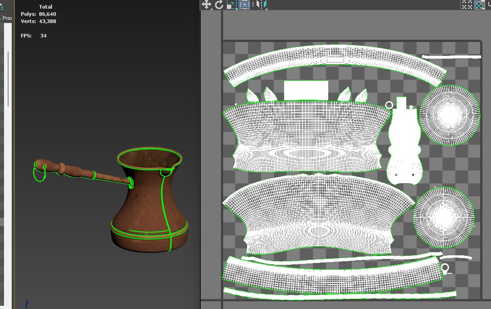
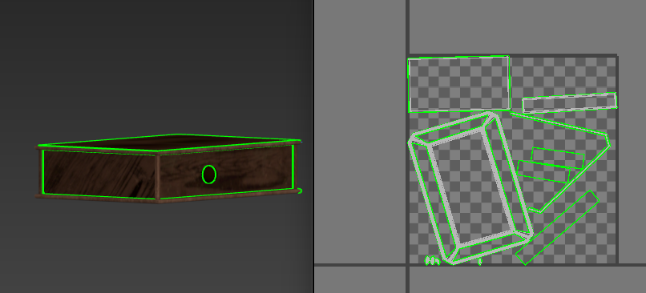
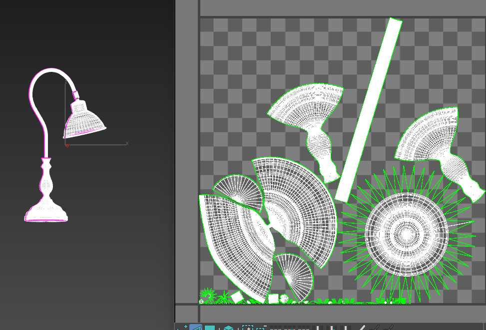
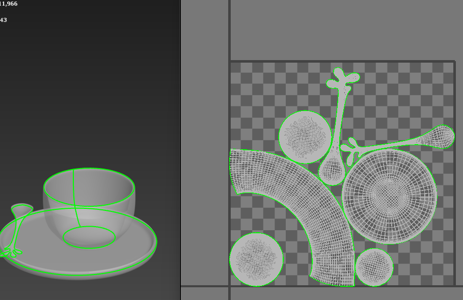

# 3D Environment & Material Design Portfolio

This repository showcases selected 3D modeling, texturing, lighting and rendering projects created as part of my coursework in **Animation Engineering & Computer Graphics** at the Faculty of Technical Sciences, University of Novi Sad.

---

## Software

- Autodesk 3ds Max
- Adobe Substance 3D Painter
- Adobe Photoshop
- V-Ray

---

## Skills

- 3D Modeling
- UV Mapping
- Material Creation
- Texture Painting
- Interior Lighting
- Exterior Lighting
- Rendering
- Asset Preparation

---

# Final Scene

---

# Interior

---

# Exterior

---

# UV Mapping

---

# Texturing

---

## Workflow

The project included:

- 3D Modeling
- UV Unwrapping
- Material Creation
- Texturing in Adobe Substance 3D Painter
- Lighting Setup
- Final Rendering

---

## Author

**Nataša Todorović**

Animation Engineering & Computer Graphics Student

Faculty of Technical Sciences, University of Novi Sad
