# Environment-Texturing-and-Lighting

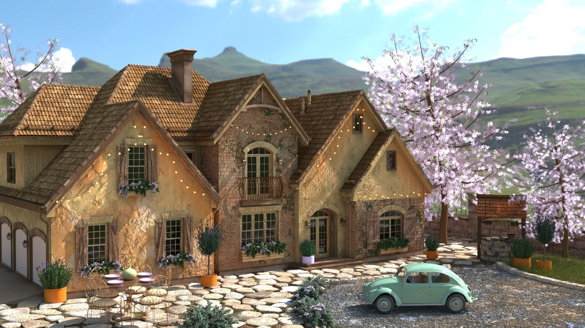

This repository showcases selected 3D modeling, texturing, lighting and rendering projects created as part of my coursework in **Animation Engineering & Computer Graphics** at the Faculty of Technical Sciences, University of Novi Sad.

---

## Software

- Autodesk 3ds Max
- Adobe Substance 3D Painter
- Adobe Photoshop
- V-Ray

---

## Skills

- 3D Modeling
- UV Mapping
- Material Creation
- Texture Painting
- Interior & Exterior Lighting
- Rendering

---

# Final Renders

### Interior – Day

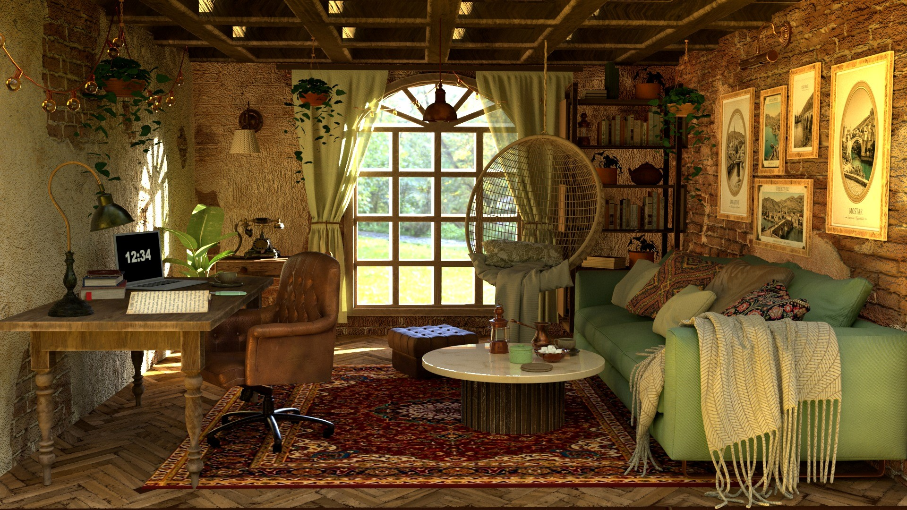

### Interior – Night

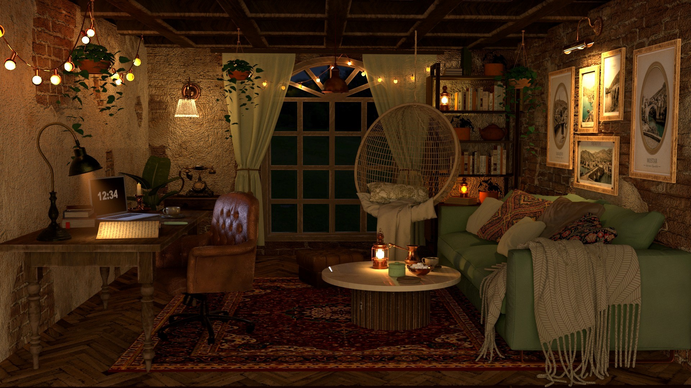

### Day Render

### Night Render

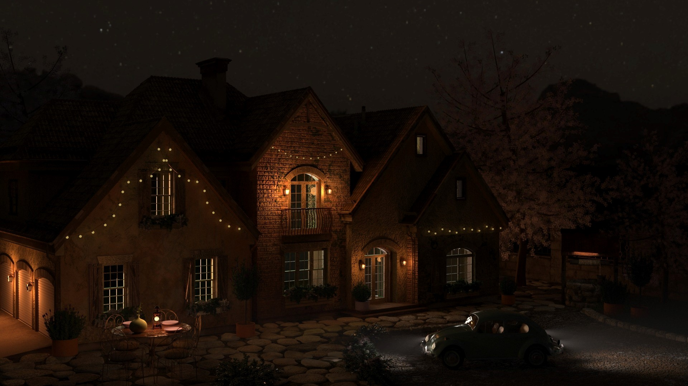

---

# Asset Workflow

## Coffee Pot

| UV Mapping | Substance Painter | Final Model |
|------------|-------------------|-------------|
|  | 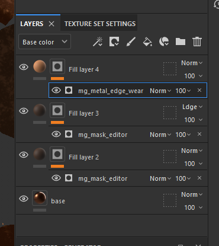 | 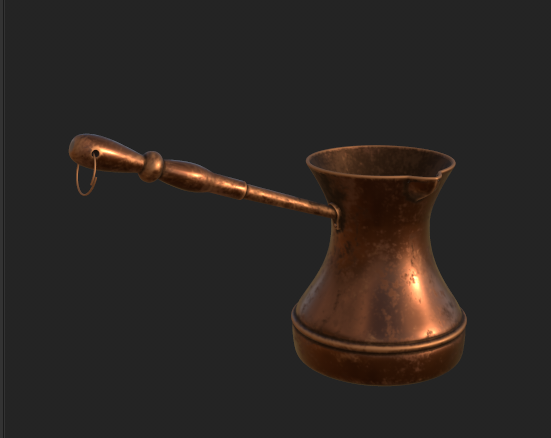 |

---

## Coffee Table

| UV Mapping | Final Model |
|------------|-------------|
| 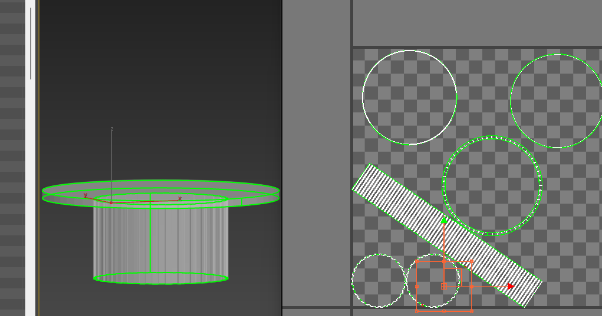 | 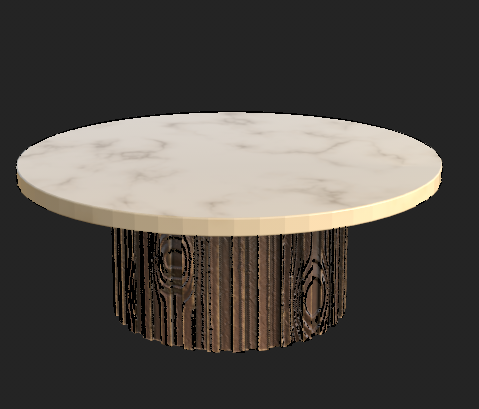 |

---

## Sofa

| UV Mapping | Substance Painter | Final Model |
|------------|-------------------|-------------|
| 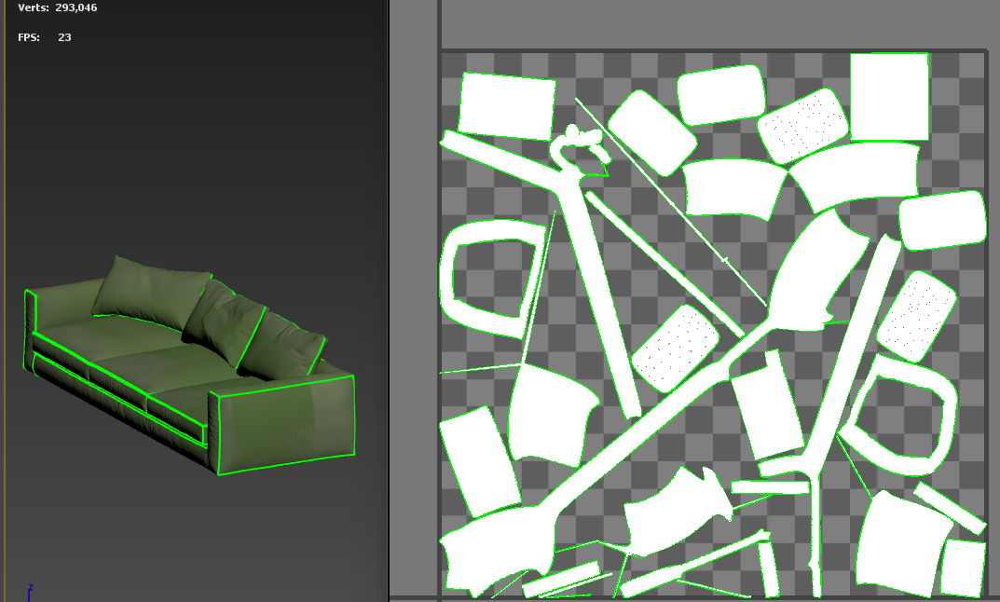 | 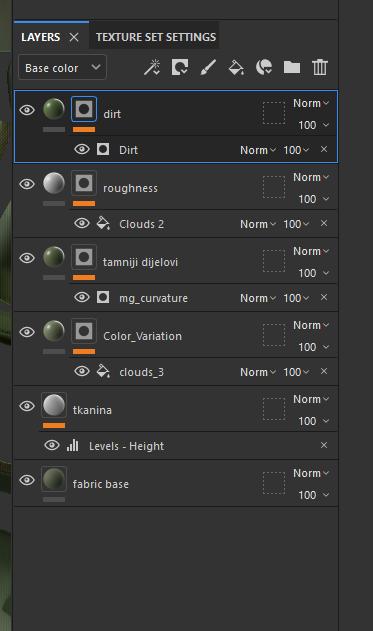 | 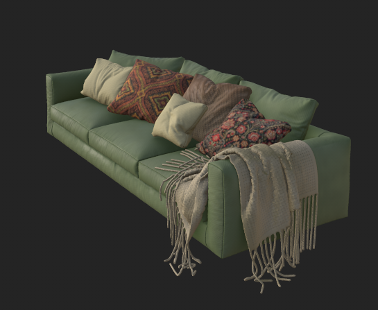 |

---

## Cabinet

| UV Mapping | Substance Painter | Final Model |
|------------|-------------------|-------------|
|  | 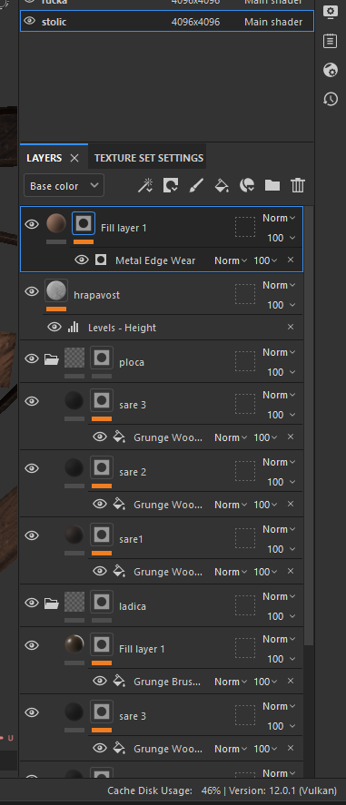 | 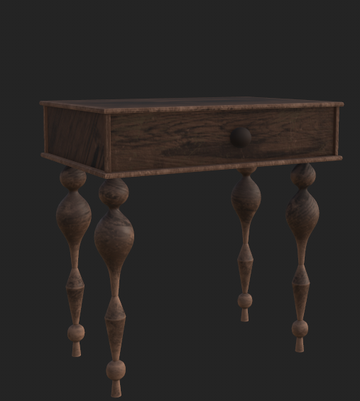 |

---

## Wall Lamp

| UV Mapping | Texture | Final Model |
|------------|----------|-------------|
| 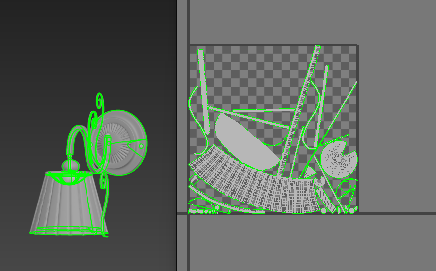 | 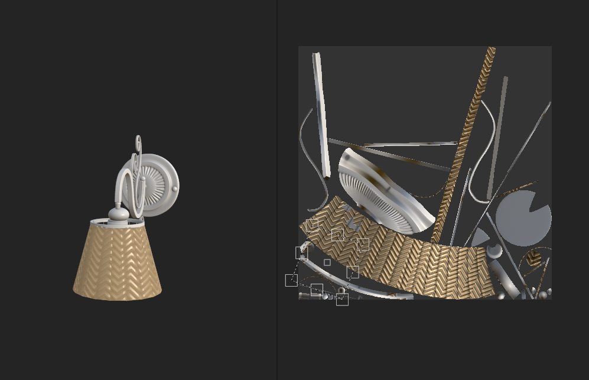 | 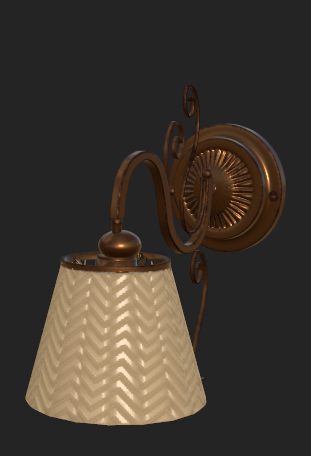 |

---

## Table Lamp

| UV Mapping | Substance Painter | Final Model |
|------------|-------------------|-------------|
|  | 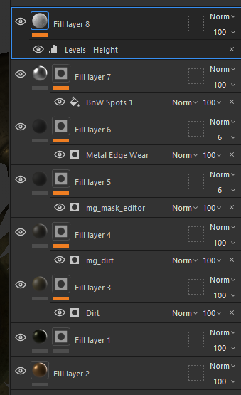 | 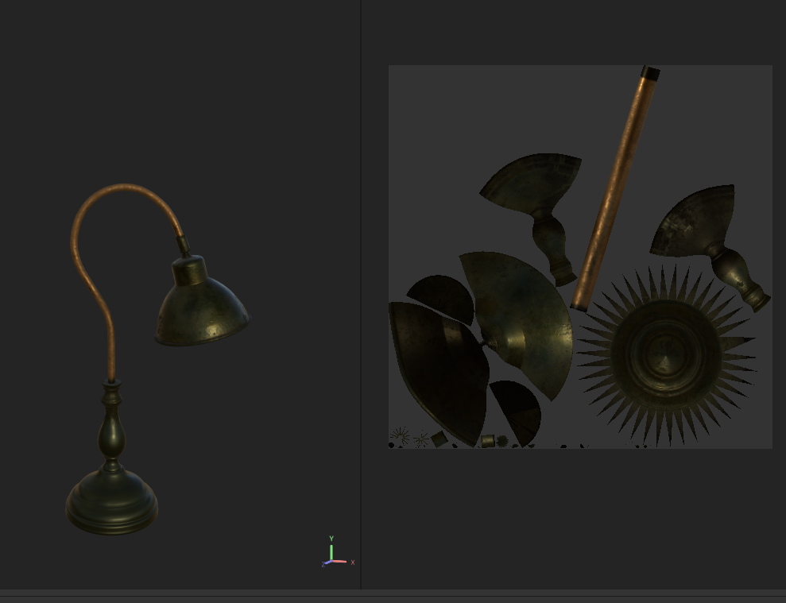 |

---

## Cup

| UV Mapping | Texture | Final Model |
|------------|----------|-------------|
|  | 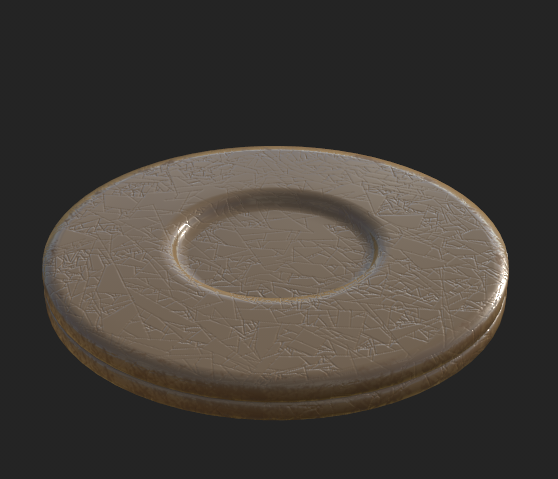 | 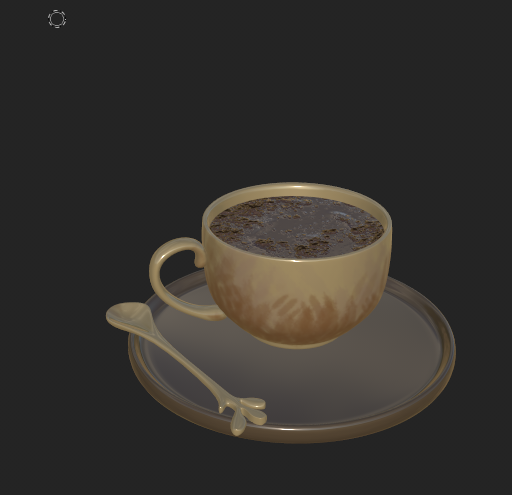 |
---

## Swing

| Texture | Final Model |
|----------|-------------|
| 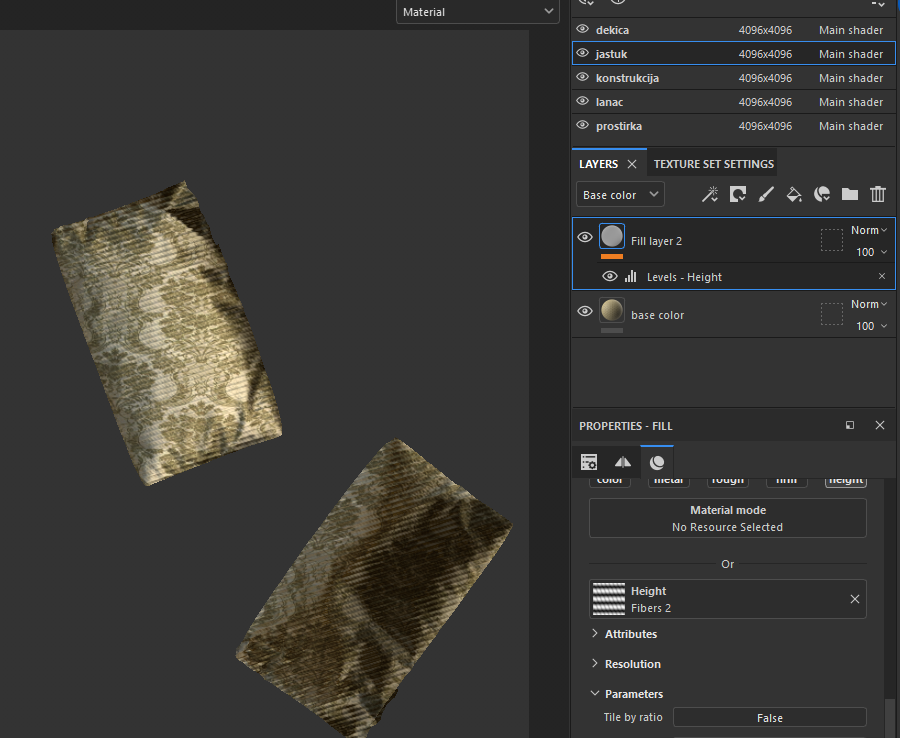 | 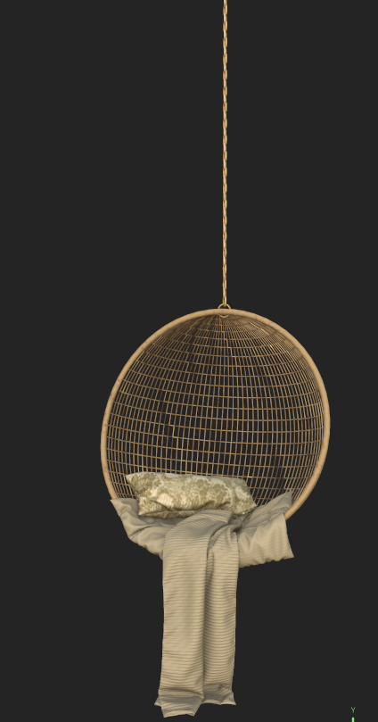 |

---

## Workflow

This project demonstrates the complete workflow for creating a 3D environment:

- 3D asset modeling
- UV unwrapping
- Material creation
- Texturing in Adobe Substance 3D Painter
- Interior and exterior lighting
- Final rendering using V-Ray

---

## Author

**Nataša Todorović**

Animation Engineering & Computer Graphics Student  
Faculty of Technical Sciences, University of Novi Sad
